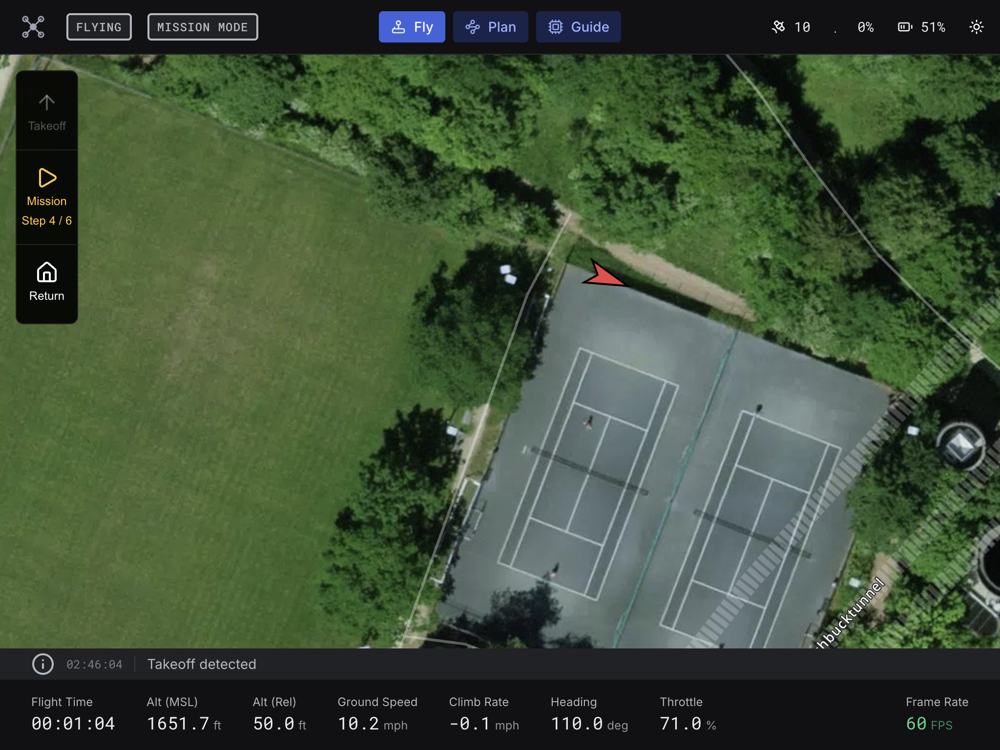
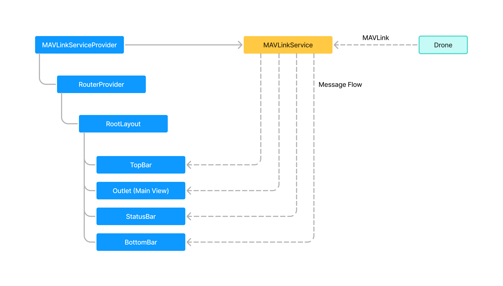

# Flightpath UI

Frontend for the Flightpath platform – a Ground Control Station (GCS) to control
a drone.



## Architecture



The architecture uses RxJS observables as a reactive layer between the MAVLink
protocol and React components. This approach provides several key benefits:

1. **Declarative Logic & Cleaner Code**: Instead of imperative `useEffect`
   chains, RxJS defines data transformations declaratively. This centralizes
   business logic outside of components, making the code more readable and
   easier to maintain. See `FlightStatusService` as an example.

2. **Efficient State Propagation**: Updates are only propagated to the specific
   components that subscribe to a stream. This avoids the "unnecessary
   re-render" issue common with React Context, where updating one value can
   re-render an entire component tree.

3. **Decoupled Architecture**: Business logic is kept in pure TypeScript classes
   as observables, entirely independent of React. This makes the logic more
   portable and significantly easier to unit test without the overhead of
   rendering components.

## Prerequisites for development

1. Install [Node Version Manager](https://github.com/nvm-sh/nvm) (nvm). It
   allows using different versions of node via the command line
2. Run `nvm use` to use the required version of node.
3. Run `pnpm i` to install required packages.
4. Start a PX4 SITL by following the instructions in
   [PX4 SITL Setup](https://github.com/flightpath-dev/flightpath/blob/main/docs/px4-sitl-setup.md).
5. Run the Flightpath Server by following the instructions in the
   [Flightpath repository](https://github.com/flightpath-dev/flightpath)
   (`go run cmd/server/main.go`).

## Development Build

```shell
pnpm dev
```

Now point your browser to http://localhost:3000

## Production Build

```shell
cd apps/flightpath-ui-radix
pnpm build
pnpm preview
```

Now point your browser to http://localhost:3000

## All Commands

```
pnpm build            # builds prod bundles
pnpm clean            # deletes all build artifacts
pnpm dev              # run all dev builds
pnpm fix              # lints, formats and attempts to fix any issues (requires `pnpm build` has been ran)
pnpm lint             # runs the linter, useful for debugging lint issues (generally `pnpm fix` is preferred)
pnpm preview          # runs the prod build (go to the appropriate app directory first)
```

## Performance

| CPU           | gRPC Stream | FPS |
| ------------- | :---------: | :-: |
| No throttling |     ❌      | 60  |
| 4x slowdown   |     ❌      | 60  |
| 6x slowdown   |     ❌      | 60  |
| 20x slowdown  |     ❌      | 55  |
| No throttling |     ✅      | 60  |
| 4x slowdown   |     ✅      | 42  |
| 6x slowdown   |     ✅      | 24  |
| 20x slowdown  |     ✅      | 10  |
